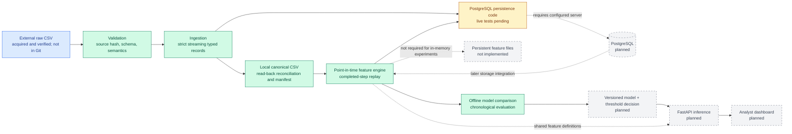

# Planned architecture

The diagram distinguishes verified local ingestion/features/modelling (green), Stage 4D persistence code awaiting live database tests (amber), and unimplemented work (grey). The authoritative source is not stored in Git. No PostgreSQL server has been installed or used for acceptance testing here.

## Component responsibilities

| Component | Responsibility | Current status |
|---|---|---|
| External raw CSV | Immutable source acquired from the documented dataset record; checksum and metadata recorded locally. | Acquired and verified in Stage 2; ignored by Git |
| Ingestion | Read the CSV lazily and expose records without silently transforming values. | Strict canonical parser plus compatible inspection utilities |
| Validation | Enforce the artifact, structural and semantic contracts; reconcile input and output. | Implemented for local canonical runs |
| Local canonical output | Preserve every transaction and source monetary lexeme with deterministic identity, field order and lineage. | Verified CSV and deterministic completed-run manifest; ignored by Git |
| PostgreSQL | Store canonical transactions, separate predictor tiers, lineage and verified-load records. | Migrations and loader implemented; local contract tests only; live integration NOT RUN |
| Feature pipeline | Build features using only information available at each decision time; eventually share definitions with online scoring. | In-memory Core/Enhanced replay implemented; final feature files and serving integration remain planned |
| Model | Compare fixed models using chronological partitions and validation-only selection. | Five experiments evaluated; no calibration fit or model-serving bundle |
| Version and decision layer | Bind model, schema, features, metrics, threshold, and provenance; route a score to an action. | Planned |
| FastAPI | Validate a request, assemble allowed features, score it, and return a versioned decision response. | Planned |
| Analyst dashboard | Present alerts, contributing evidence, and aggregate quality/performance views without replacing human judgement. | Planned |

## Initial design decisions

- **Batch first, local first:** Stage 4B builds canonical local output; 4C implements point-in-time features; 4D adds PostgreSQL persistence code (live acceptance pending). The September 11 request expands 4E to offline modelling from contract-verified in-memory features. The canonical schema, feature definitions and storage target remain unchanged.
- **Contract before transformation:** reject missing or duplicate required columns rather than guessing or silently filling them.
- **Raw data is immutable and local:** the repository stores instructions and provenance, not source transactions.
- **Point-in-time correctness:** post-transaction balances and future history are not automatically valid inference features.
- **Model score and business action are separate:** a threshold can change without retraining, and evaluation can reflect alert capacity.
- **One feature definition:** batch training and API scoring must eventually share versioned transformations to reduce training-serving skew.

## Stage 1 interface boundary

`transactionshield.ingestion.inspect_csv` reads and validates only a CSV header. `iter_csv_rows` validates that header, checks each row's field count, and yields untyped string mappings lazily. This historical inspection interface remains compatible: it does not perform semantic validation or canonical materialisation. The separate Stage 4B production path uses `canonical.py`, `validation.py`, `materialisation.py`, and `pipeline.py`; see the [runbook](stage4b-canonical-pipeline.md). Neither path constructs predictive features or loads PostgreSQL yet.

Stage 4C's separate adapter projects validated canonical records to a five-field
`BehaviouralEvent`. The history engine cannot receive labels, post-balances,
pre-balances or lineage objects. Core results and optional current pre-balances
form separate immutable predictor objects, with lineage held in a distinct
metadata object. Full-artifact validation reuses the verified source gate and
canonical parser without rewriting canonical output; it produces only summary
statistics and diagnostic hashes. See the [Stage 4C runbook](stage4c-feature-engine.md).

Stage 4D reuses that same canonical parser and feature adapter, rather than
reimplementing history in SQL. One database transaction encloses batched writes,
source guard exit, reconciliation and server-cursor read-back. The final completion
row is inserted only after these checks; failures request rollback. Existing
loads are verified without overwrite. These behaviours have unit tests; actual
PostgreSQL execution remains unverified. See the [runbook](stage4d-postgres.md).

Stage 4E generates exact features through the existing parser/engine and verifies
their approved hashes before an explicit estimator-only float64 conversion.
Training and validation are the only inputs to model/threshold selection. Test
evaluation follows a persisted selection record. See [modelling and results](stage4e-modelling.md).
