# Planned architecture

The diagram distinguishes the implemented Stage 4B local canonical pipeline (green) from future work (grey). The authoritative source was acquired and audited in Stage 2 and is not stored in Git. PostgreSQL remains the approved storage target, not an installed or integrated dependency.

```mermaid
flowchart LR
    A[External raw CSV<br/>acquired and verified; not in Git]
    B[Ingestion<br/>strict streaming typed records]
    V[Validation<br/>source hash, schema, semantics]
    L[Local canonical CSV<br/>read-back reconciliation and manifest]
    C[(PostgreSQL<br/>planned)]
    D[Point-in-time feature pipeline<br/>planned]
    E[Model training and evaluation<br/>planned]
    F[Versioned model + threshold decision<br/>planned]
    G[FastAPI inference<br/>planned]
    H[Analyst dashboard<br/>planned]

    A --> V --> B --> L
    L --> D --> E --> F --> G --> H
    L --> C
    C -. later storage integration .-> D
    D -. shared feature definitions .-> G

    classDef implemented fill:#d1fae5,stroke:#047857,color:#064e3b;
    classDef future fill:#f3f4f6,stroke:#6b7280,color:#374151,stroke-dasharray: 5 5;
    classDef external fill:#dbeafe,stroke:#2563eb,color:#1e3a8a;
    class B,V,L implemented;
    class C,D,E,F,G,H future;
    class A external;
```

## Component responsibilities

| Component | Responsibility | Status through Stage 4B |
|---|---|---|
| External raw CSV | Immutable source acquired from the documented dataset record; checksum and metadata recorded locally. | Acquired and verified in Stage 2; ignored by Git |
| Ingestion | Read the CSV lazily and expose records without silently transforming values. | Strict canonical parser plus compatible inspection utilities |
| Validation | Enforce the artifact, structural and semantic contracts; reconcile input and output. | Implemented for local canonical runs |
| Local canonical output | Preserve every transaction and source monetary lexeme with deterministic identity, field order and lineage. | Verified CSV and deterministic completed-run manifest; ignored by Git |
| PostgreSQL | Store typed transactions, load metadata, quality results, and queryable indexes. | Planned |
| Feature pipeline | Build offline features using only information available at each decision time; share definitions with online scoring. | Planned |
| Model | Train with temporal splits, evaluate, calibrate if needed, and emit a risk score. | Planned |
| Version and decision layer | Bind model, schema, features, metrics, threshold, and provenance; route a score to an action. | Planned |
| FastAPI | Validate a request, assemble allowed features, score it, and return a versioned decision response. | Planned |
| Analyst dashboard | Present alerts, contributing evidence, and aggregate quality/performance views without replacing human judgement. | Planned |

## Initial design decisions

- **Batch first, local first:** Stage 4B builds canonical local output; 4C will implement point-in-time features; 4D will add PostgreSQL; 4E will complete feature materialisation and acceptance. This approved implementation sequence changes the original database-first ordering, not the canonical PostgreSQL schema or the eventual storage target. Streaming file iteration here is a memory technique, not an event-streaming service.
- **Contract before transformation:** reject missing or duplicate required columns rather than guessing or silently filling them.
- **Raw data is immutable and local:** the repository stores instructions and provenance, not source transactions.
- **Point-in-time correctness:** post-transaction balances and future history are not automatically valid inference features.
- **Model score and business action are separate:** a threshold can change without retraining, and evaluation can reflect alert capacity.
- **One feature definition:** batch training and API scoring must eventually share versioned transformations to reduce training-serving skew.

## Stage 1 interface boundary

`transactionshield.ingestion.inspect_csv` reads and validates only a CSV header. `iter_csv_rows` validates that header, checks each row's field count, and yields untyped string mappings lazily. This historical inspection interface remains compatible: it does not perform semantic validation or canonical materialisation. The separate Stage 4B production path uses `canonical.py`, `validation.py`, `materialisation.py`, and `pipeline.py`; see the [runbook](stage4b-canonical-pipeline.md). Neither path constructs predictive features or loads PostgreSQL yet.
