# Planned architecture

The diagram is a target flow, not a claim that the full platform exists. Only the green ingestion and validation boxes have a Stage 1 code skeleton. The external source is not stored in Git, and every grey box is future work.

```mermaid
flowchart LR
    A[External raw CSV<br/>not downloaded; not in Git]
    B[Ingestion<br/>Stage 1: lazy CSV row iterator]
    V[Validation<br/>Stage 1: header and row-shape contract]
    C[(PostgreSQL<br/>planned)]
    D[Point-in-time feature pipeline<br/>planned]
    E[Model training and evaluation<br/>planned]
    F[Versioned model + threshold decision<br/>planned]
    G[FastAPI inference<br/>planned]
    H[Analyst dashboard<br/>planned]

    A --> B --> V --> C --> D --> E --> F --> G --> H
    D -. shared feature definitions .-> G

    classDef implemented fill:#d1fae5,stroke:#047857,color:#064e3b;
    classDef future fill:#f3f4f6,stroke:#6b7280,color:#374151,stroke-dasharray: 5 5;
    classDef external fill:#dbeafe,stroke:#2563eb,color:#1e3a8a;
    class B,V implemented;
    class C,D,E,F,G,H future;
    class A external;
```

## Component responsibilities

| Component | Responsibility | Stage 1 status |
|---|---|---|
| External raw CSV | Immutable source acquired from the documented dataset record; checksum and metadata recorded locally. | Not downloaded |
| Ingestion | Read the CSV lazily and expose records without silently transforming values. | Lazy string-row iteration only |
| Validation | Check the source contract and surface actionable structural failures before downstream loading. | Header and row-width validation only |
| PostgreSQL | Store typed transactions, load metadata, quality results, and queryable indexes. | Planned |
| Feature pipeline | Build offline features using only information available at each decision time; share definitions with online scoring. | Planned |
| Model | Train with temporal splits, evaluate, calibrate if needed, and emit a risk score. | Planned |
| Version and decision layer | Bind model, schema, features, metrics, threshold, and provenance; route a score to an action. | Planned |
| FastAPI | Validate a request, assemble allowed features, score it, and return a versioned decision response. | Planned |
| Analyst dashboard | Present alerts, contributing evidence, and aggregate quality/performance views without replacing human judgement. | Planned |

## Initial design decisions

- **Batch first:** a replayable CSV-to-database path is enough for the MVP. Streaming is a later extension.
- **Contract before transformation:** reject missing or duplicate required columns rather than guessing or silently filling them.
- **Raw data is immutable and local:** the repository stores instructions and provenance, not source transactions.
- **Point-in-time correctness:** post-transaction balances and future history are not automatically valid inference features.
- **Model score and business action are separate:** a threshold can change without retraining, and evaluation can reflect alert capacity.
- **One feature definition:** batch training and API scoring must eventually share versioned transformations to reduce training-serving skew.

## Stage 1 interface boundary

`transactionshield.ingestion.inspect_csv` reads and validates only a CSV header. `iter_csv_rows` validates that header, checks each row's field count, and yields untyped string mappings lazily. It intentionally does not count a multi-million-row file, coerce values, apply semantic business rules, mutate data, load PostgreSQL, or derive features. Those additions require a locally validated dataset in Stage 2.
